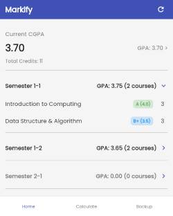
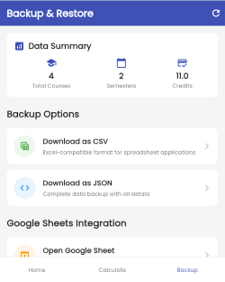

# Markify

Markify is a lightweight Flutter app that tracks your CGPA using **Google Sheets** as a backend database, with **Google Apps Script** providing a RESTful API interface. 

## Technology Stack

- **Flutter**: Client-side app for UI and API communication
- **Google Sheets**: Cloud spreadsheet database for student records
- **Google Apps Script**: Backend REST API layer deployed as a Web App

---
## Preview






## Script for `code.gs`

```javascript
// Configuration constants
const SHEET_ID = "";
const SHEET_NAME = "Academic Records";

/**
 * Helper function to convert date to semester format
 * Converts dates like "1/1/2025" or Date objects to "1-1" format
 */
function formatSemesterFromDate(dateValue) {
  if (!dateValue) return "";
  
  let month, day;
  
  if (dateValue instanceof Date) {
    // It's a Date object
    month = dateValue.getMonth() + 1; // getMonth() returns 0-11
    day = dateValue.getDate();
  } else if (typeof dateValue === 'string') {
    // It might be a date string like "1/1/2025" or already "1-1"
    if (dateValue.includes('/')) {
      const parts = dateValue.split('/');
      month = parseInt(parts[0]);
      day = parseInt(parts[1]);
    } else if (dateValue.includes('-')) {
      // Already in correct format
      return dateValue;
    } else {
      // Unknown format, return as is
      return dateValue.toString();
    }
  } else {
    // Try to convert to string
    return dateValue.toString();
  }
  
  // Convert to semester format (e.g., 1/1 -> 1-1, 1/2 -> 1-2)
  return `${month}-${day}`;
}

/**
 * Helper function to convert semester format to date for Google Sheets
 * Converts "1-1" to a date that Google Sheets will recognize
 */
function semesterToDate(semester) {
  if (!semester || typeof semester !== 'string') return semester;
  
  const parts = semester.split('-');
  if (parts.length === 2) {
    const month = parseInt(parts[0]);
    const day = parseInt(parts[1]);
    // Create a date in current year for consistency
    const currentYear = new Date().getFullYear();
    return new Date(currentYear, month - 1, day); // month - 1 because Date months are 0-indexed
  }
  
  return semester;
}

/**
 * Initializes the spreadsheet with headers if they don't exist
 */
function initializeSpreadsheet() {
  const sheet = SpreadsheetApp.openById(SHEET_ID).getSheetByName(SHEET_NAME);
  
  // Check if sheet is empty or has no data
  if (sheet.getLastRow() === 0) {
    // Create header row
    sheet.appendRow(["Semester", "Course", "Grade", "Credit Hours", "Obtained Grade", "CGPA"]);
    
    // Format the header row
    sheet.getRange(1, 1, 1, 6).setFontWeight("bold");
    sheet.getRange(1, 1, 1, 6).setBackground("#f3f3f3");
    
    // Set the Semester column (Column A) to TEXT format to prevent date conversion
    const lastRow = sheet.getLastRow();
    const range = sheet.getRange(2, 1, sheet.getMaxRows() - 1, 1); // Column A from row 2 onwards
    range.setNumberFormat("@"); // "@" means text format
    
    return true;
  } else {
    // Ensure Semester column is formatted as text
    const range = sheet.getRange(2, 1, sheet.getMaxRows() - 1, 1);
    range.setNumberFormat("@");
  }
  
  return false;
}

/**
 * Adds formulas to the GPA and CGPA columns for a specific row
 */
function addFormulasToRow(sheet, rowIndex) {
  // GPA formula for column E (Obtained Grade per semester)
  const gpaFormula = `=IF(SUMIF($A$2:$A$100,A${rowIndex},$D$2:$D$100)=0,"",SUMPRODUCT(($A$2:$A$100=A${rowIndex})*($C$2:$C$100)*($D$2:$D$100)) / SUMIF($A$2:$A$100,A${rowIndex},$D$2:$D$100))`;
  
  // CGPA formula for column F
  const cgpaFormula = `=IFERROR(AVERAGE(UNIQUE(FILTER(E:E,ISNUMBER(E:E)))), "")`;
  
  // Set the formulas
  sheet.getRange(rowIndex, 5).setFormula(gpaFormula); // Column E - Obtained Grade
  sheet.getRange(rowIndex, 6).setFormula(cgpaFormula); // Column F - CGPA
}

/**
 * Updates all formulas in the sheet (useful after data changes)
 */
function updateAllFormulas(sheet) {
  const lastRow = sheet.getLastRow();
  
  if (lastRow > 1) { // If there's data beyond headers
    for (let i = 2; i <= lastRow; i++) {
      addFormulasToRow(sheet, i);
    }
  }
}

/**
 * Handles GET requests to retrieve all academic records
 */
function doGet(e) {
  try {
    // Check if an ID is provided for a single record
    if (e.parameter && e.parameter.id) {
      return getRecordById(parseInt(e.parameter.id));
    }
    
    // Check if a semester filter is provided
    if (e.parameter && e.parameter.semester) {
      return getRecordsBySemester(e.parameter.semester);
    }
    
    const sheet = SpreadsheetApp.openById(SHEET_ID).getSheetByName(SHEET_NAME);
    
    // Initialize spreadsheet if needed
    const initialized = initializeSpreadsheet();
    
    const values = sheet.getDataRange().getValues();
    const records = [];
    
    // If sheet was just initialized or has only headers, return empty array
    if (values.length <= 1) {
      return ContentService.createTextOutput(JSON.stringify({
        status: "SUCCESS",
        data: []
      }))
      .setMimeType(ContentService.MimeType.JSON);
    }
    
    // Skip header row and process data
    for (let i = 1; i < values.length; i++) {
      const row = values[i];
      
      // Convert semester from date format to text format
      const semesterValue = formatSemesterFromDate(row[0]);
      
      // Debug logging
      console.log(`Row ${i}: Original semester value: ${row[0]}, Formatted: ${semesterValue}`);
      
      records.push({
        id: i, // ID based on row index
        semester: semesterValue, // Use formatted semester
        course: row[1]?.toString() || "",
        grade: parseFloat(row[2]) || 0, // Ensure it's a number
        creditHours: parseFloat(row[3]) || 0,
        obtainedGrade: parseFloat(row[4]) || 0,  // Semester-wise GPA
        cgpa: parseFloat(row[5]) || 0  // Overall CGPA
      });
    }
    
    return ContentService.createTextOutput(JSON.stringify({
      status: "SUCCESS",
      data: records
    }))
    .setMimeType(ContentService.MimeType.JSON);
  } catch (error) {
    return handleError(error, "Error retrieving academic records");
  }
}

/**
 * Get a specific record by ID
 */
function getRecordById(id) {
  try {
    if (isNaN(id) || id < 1) {
      return handleError(null, "Invalid ID. Must be a positive number");
    }
    
    const sheet = SpreadsheetApp.openById(SHEET_ID).getSheetByName(SHEET_NAME);
    const rowIndex = id + 1; // Account for header row
    
    // Check if row exists
    if (rowIndex > sheet.getLastRow()) {
      return handleError(null, "Record ID not found");
    }
    
    const rowData = sheet.getRange(rowIndex, 1, 1, 6).getValues()[0];
    
    const record = {
      id: id,
      semester: formatSemesterFromDate(rowData[0]), // Format semester
      course: rowData[1]?.toString() || "",
      grade: parseFloat(rowData[2]) || 0,
      creditHours: parseFloat(rowData[3]) || 0,
      obtainedGrade: parseFloat(rowData[4]) || 0,
      cgpa: parseFloat(rowData[5]) || 0
    };
    
    return ContentService.createTextOutput(JSON.stringify({
      status: "SUCCESS",
      data: record
    }))
    .setMimeType(ContentService.MimeType.JSON);
  } catch (error) {
    return handleError(error, "Error retrieving record");
  }
}

/**
 * Get records filtered by semester
 */
function getRecordsBySemester(semester) {
  try {
    const sheet = SpreadsheetApp.openById(SHEET_ID).getSheetByName(SHEET_NAME);
    const values = sheet.getDataRange().getValues();
    const records = [];
    
    // Clean the semester parameter - remove "Semester " prefix if present
    let cleanSemester = semester;
    if (semester.toLowerCase().startsWith('semester ')) {
      cleanSemester = semester.substring(9); // Remove "Semester " (9 characters)
    }
    
    console.log(`Searching for semester: "${cleanSemester}" (original: "${semester}")`);
    
    // Skip header row and filter by semester
    for (let i = 1; i < values.length; i++) {
      const row = values[i];
      const rowSemester = formatSemesterFromDate(row[0]); // Format semester from date
      
      console.log(`Row ${i}: original="${row[0]}", formatted="${rowSemester}"`);
      
      if (rowSemester === cleanSemester) {
        records.push({
          id: i,
          semester: rowSemester,
          course: row[1]?.toString() || "",
          grade: parseFloat(row[2]) || 0,
          creditHours: parseFloat(row[3]) || 0,
          obtainedGrade: parseFloat(row[4]) || 0,
          cgpa: parseFloat(row[5]) || 0
        });
      }
    }
    
    console.log(`Found ${records.length} records for semester "${cleanSemester}"`);
    
    return ContentService.createTextOutput(JSON.stringify({
      status: "SUCCESS",
      data: records
    }))
    .setMimeType(ContentService.MimeType.JSON);
  } catch (error) {
    return handleError(error, "Error retrieving records by semester");
  }
}

/**
 * Handles POST requests for create, update, and delete operations
 */
function doPost(e) {
  try {
    if (!e.parameter || !e.parameter.action) {
      return handleError(null, "Missing 'action' parameter");
    }
    
    const action = e.parameter.action;
    
    switch (action) {
      case "create":
        return createRecord(e);
      case "update":
        return updateRecord(e);
      case "delete":
        return deleteRecord(e);
      default:
        return handleError(null, "Invalid action. Must be 'create', 'update', or 'delete'");
    }
  } catch (error) {
    return handleError(error, "Error processing request");
  }
}

/**
 * Creates a new academic record
 */
function createRecord(e) {
  try {
    // Validate required inputs
    if (!e.parameter.semester || !e.parameter.course || !e.parameter.grade || !e.parameter.creditHours) {
      return handleError(null, "Missing required fields (semester, course, grade, creditHours)");
    }
    
    const semester = e.parameter.semester;
    const course = e.parameter.course;
    const grade = parseFloat(e.parameter.grade);
    const creditHours = parseFloat(e.parameter.creditHours);
    
    // Validate grade
    if (isNaN(grade) || grade < 0 || grade > 4.0) {
      return handleError(null, "Grade must be a number between 0 and 4.0");
    }
    
    // Validate credit hours
    if (isNaN(creditHours) || creditHours <= 0) {
      return handleError(null, "Credit Hours must be a positive number");
    }
    
    const sheet = SpreadsheetApp.openById(SHEET_ID).getSheetByName(SHEET_NAME);
    
    // Initialize spreadsheet if needed
    initializeSpreadsheet();
    
    // Add the new row with data - store semester as text to prevent date conversion
    sheet.appendRow([semester, course, grade, creditHours, "", ""]);
    
    const newRowIndex = sheet.getLastRow();
    
    // Ensure the semester cell is formatted as text
    sheet.getRange(newRowIndex, 1).setNumberFormat("@");
    sheet.getRange(newRowIndex, 1).setValue(semester); // Re-set as text
    
    // Add formulas to the new row
    addFormulasToRow(sheet, newRowIndex);
    
    // Update all formulas to ensure CGPA is calculated correctly
    updateAllFormulas(sheet);
    
    return ContentService.createTextOutput(JSON.stringify({
      status: "SUCCESS",
      message: "Academic record created successfully"
    }))
    .setMimeType(ContentService.MimeType.JSON);
  } catch (error) {
    return handleError(error, "Error creating academic record");
  }
}

/**
 * Updates an existing academic record
 */
function updateRecord(e) {
  try {
    const id = parseInt(e.parameter.id);
    
    // Validate ID
    if (isNaN(id) || id < 1) {
      return handleError(null, "Invalid ID. Must be a positive number");
    }
    
    const sheet = SpreadsheetApp.openById(SHEET_ID).getSheetByName(SHEET_NAME);
    
    // Initialize spreadsheet if needed
    const wasInitialized = initializeSpreadsheet();
    if (wasInitialized) {
      return handleError(null, "No records exist yet. Sheet was just initialized with headers.");
    }
    
    const rowIndex = id + 1; // Account for header row
    
    // Check if row exists
    if (rowIndex > sheet.getLastRow()) {
      return handleError(null, "Record ID not found");
    }
    
    // Get current values to update only provided fields
    const currentValues = sheet.getRange(rowIndex, 1, 1, 4).getValues()[0];
    
    const semester = e.parameter.semester !== undefined ? e.parameter.semester : formatSemesterFromDate(currentValues[0]);
    const course = e.parameter.course !== undefined ? e.parameter.course : currentValues[1];
    
    let grade = currentValues[2];
    if (e.parameter.grade !== undefined) {
      grade = parseFloat(e.parameter.grade);
      if (isNaN(grade) || grade < 0 || grade > 4.0) {
        return handleError(null, "Grade must be a number between 0 and 4.0");
      }
    }
    
    let creditHours = currentValues[3];
    if (e.parameter.creditHours !== undefined) {
      creditHours = parseFloat(e.parameter.creditHours);
      if (isNaN(creditHours) || creditHours <= 0) {
        return handleError(null, "Credit Hours must be a positive number");
      }
    }
    
    // Update the user-editable fields
    sheet.getRange(rowIndex, 1).setNumberFormat("@"); // Format as text first
    sheet.getRange(rowIndex, 1).setValue(semester);
    sheet.getRange(rowIndex, 2).setValue(course);
    sheet.getRange(rowIndex, 3).setValue(grade);
    sheet.getRange(rowIndex, 4).setValue(creditHours);
    
    // Update formulas for this row and all rows (in case semester changed)
    updateAllFormulas(sheet);
    
    return ContentService.createTextOutput(JSON.stringify({
      status: "SUCCESS",
      message: "Academic record updated successfully"
    }))
    .setMimeType(ContentService.MimeType.JSON);
  } catch (error) {
    return handleError(error, "Error updating academic record");
  }
}

/**
 * Deletes an academic record
 */
function deleteRecord(e) {
  try {
    const id = parseInt(e.parameter.id);
    
    // Validate ID
    if (isNaN(id) || id < 1) {
      return handleError(null, "Invalid ID. Must be a positive number");
    }
    
    const sheet = SpreadsheetApp.openById(SHEET_ID).getSheetByName(SHEET_NAME);
    
    // Initialize spreadsheet if needed
    const wasInitialized = initializeSpreadsheet();
    if (wasInitialized) {
      return handleError(null, "No records exist yet. Sheet was just initialized with headers.");
    }
    
    const rowIndex = id + 1; // Account for header row
    
    // Check if row exists
    if (rowIndex > sheet.getLastRow()) {
      return handleError(null, "Record ID not found");
    }
    
    sheet.deleteRow(rowIndex);
    
    // Update formulas for all remaining rows
    updateAllFormulas(sheet);
    
    return ContentService.createTextOutput(JSON.stringify({
      status: "SUCCESS",
      message: "Academic record deleted successfully"
    }))
    .setMimeType(ContentService.MimeType.JSON);
  } catch (error) {
    return handleError(error, "Error deleting academic record");
  }
}

/**
 * Helper function to handle errors consistently
 */
function handleError(error, message) {
  console.error(error); // Log the error for debugging
  
  return ContentService.createTextOutput(JSON.stringify({
    status: "ERROR",
    message: message,
    details: error ? error.toString() : null
  }))
  .setMimeType(ContentService.MimeType.JSON);
}

/**
 * Utility function to fix existing date-formatted semesters
 * Run this once to convert existing dates back to semester format
 */
function fixExistingSemesters() {
  const sheet = SpreadsheetApp.openById(SHEET_ID).getSheetByName(SHEET_NAME);
  const lastRow = sheet.getLastRow();
  
  if (lastRow <= 1) return; // No data to fix
  
  // Get all data in column A (semester column)
  const semesterRange = sheet.getRange(2, 1, lastRow - 1, 1);
  const semesterValues = semesterRange.getValues();
  
  // Convert each semester value
  for (let i = 0; i < semesterValues.length; i++) {
    const originalValue = semesterValues[i][0];
    const convertedValue = formatSemesterFromDate(originalValue);
    
    if (originalValue !== convertedValue) {
      console.log(`Row ${i + 2}: Converting "${originalValue}" to "${convertedValue}"`);
      const cell = sheet.getRange(i + 2, 1);
      cell.setNumberFormat("@"); // Set as text
      cell.setValue(convertedValue);
    }
  }
  
  // Update all formulas after fixing
  updateAllFormulas(sheet);
  
  console.log('Semester conversion completed');
}
```